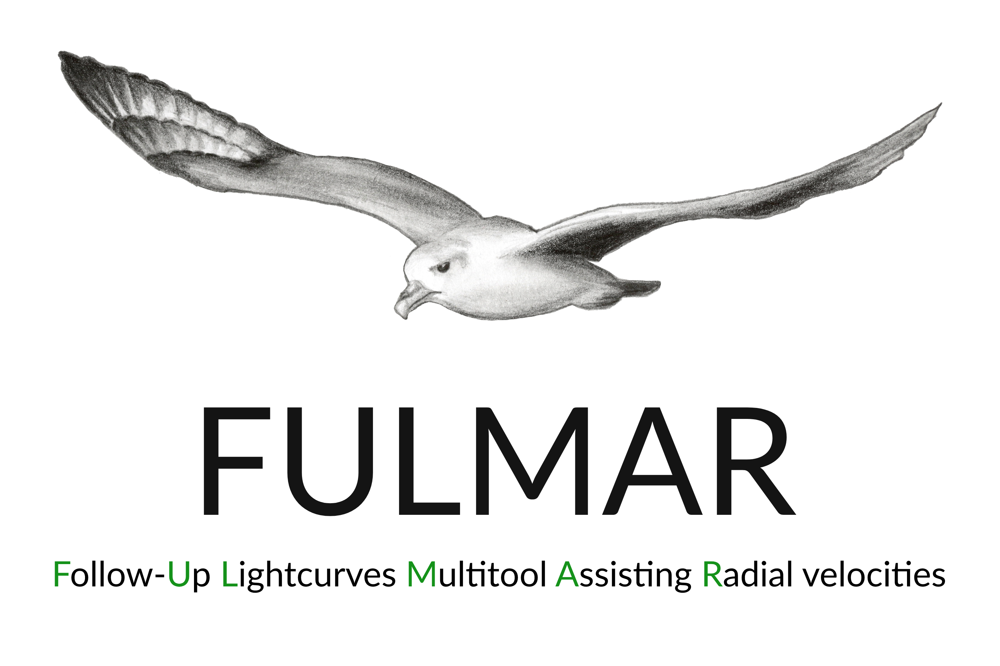

Welcome to FULMAR's documentation!
===================================

**FULMAR** is a modular tool for analyzing light curves in support of radial velocity follow-up of transiting exoplanets.
It aims at selecting suitable RV follow-up targets more effectively and making their analysis easier. 
It was build in a modular way, making new features easier to implement.

Check out the :doc:`installation` section to start using FULMAR.

FULMAR has its documentation hosted on Read the Docs.

.. note::

   This project is under active development.

Contents
--------

.. toctree::

   installation
   api
